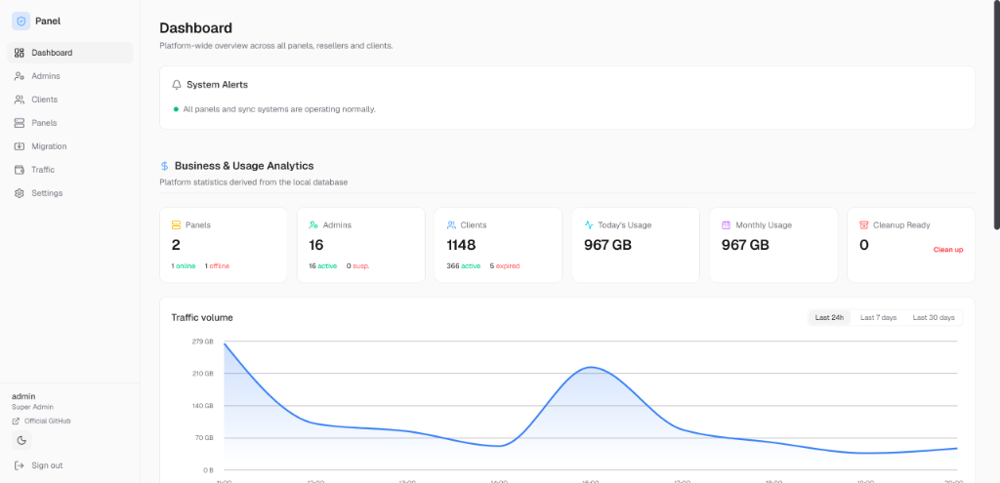
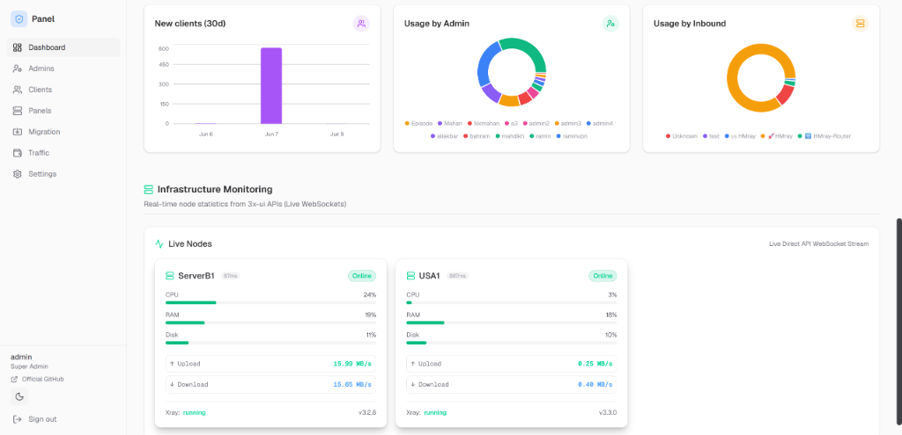
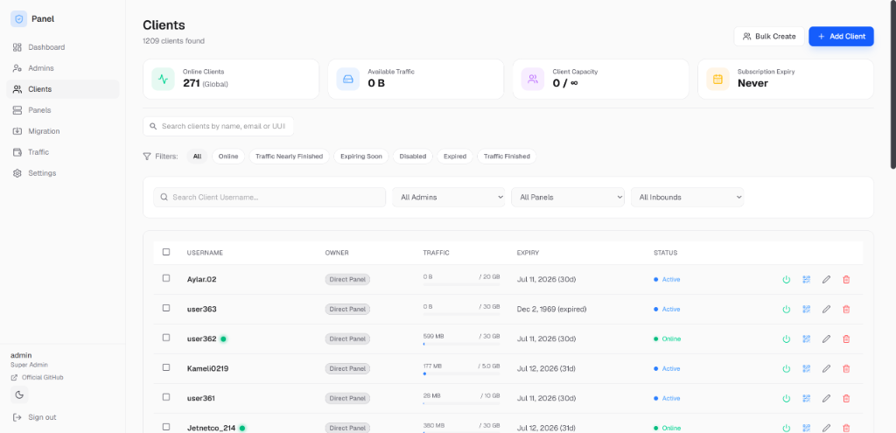

<div align="center">

# HMPanel
**Advanced 3x-ui Management Platform**


[English](#english) | [فارسی](#فارسی)

</div>

---

<h2 id="english">🇬🇧 English</h2>

HMPanel is a **professional management layer built specifically on top of native 3x-ui**. Designed for VPN Providers, Resellers, and Administrators managing large client bases across multi-panel deployments.

### 🚀 Installation

Execute the following on a fresh Ubuntu (20.04+) or Debian server:
```bash
bash <(curl -fsSL https://raw.githubusercontent.com/neoauroraproject/hmpanel/main/install.sh)
```
*(Requires: Direct public IP for Let's Encrypt SSL, 1GB RAM, 5GB Disk)*

<details>
<summary><b>📸 Screenshots (Click to expand)</b></summary>

### Super Admin Dashboard


### Infrastructure Monitoring


### Client Management


</details>

### ⚡ Key Features
- **Multi-Panel & Reseller Management:** Control multiple 3x-ui nodes, manage resellers with multi-tier permissions, and set traffic/client limits.
- **Advanced Traffic Accounting:** Real-time collection, automated grace periods, usage-based & allocation-based modes, and secure refund auditing.
- **Native 3x-ui Integration:** Cleanly maps clients to native 3x-ui groups. Attach one client to multiple inbounds seamlessly.
- **Automated Backup System:** Download, upload, and restore PostgreSQL database backups directly from the Web UI.
- **Bulk Operations & Migration Engine:** Efficiently manage clients in bulk and migrate easily from legacy panels (e.g., WhalePanel).

### 💾 Backup & Restore
- **Web UI (New!):** Go to *Settings > System Maintenance* to download, upload, or restore backups with one click.
- **CLI Manager:** Run `sudo hm` to create or restore backups safely via the terminal.

---

<h2 id="فارسی">🇮🇷 فارسی</h2>

اچ‌ام‌پنل (HMPanel) یک **لایه مدیریت حرفه‌ای و پیشرفته برای پنل‌های 3x-ui** است که منحصراً برای ارائه‌دهندگان VPN و ادمین‌هایی که چندین سرور و تعداد زیادی کاربر دارند طراحی شده است.

### 🚀 نصب و راه‌اندازی

دستور زیر را در یک سرور اوبونتو (20.04+) یا دبیان جدید و خام وارد کنید:
```bash
bash <(curl -fsSL https://raw.githubusercontent.com/neoauroraproject/hmpanel/main/install.sh)
```
*(پیش‌نیازها: آی‌پی پابلیک مستقیم برای دریافت SSL، حداقل 1 گیگابایت رم، 5 گیگابایت فضای ذخیره‌سازی)*

<details>
<summary><b>📸 تصاویر پنل (برای مشاهده کلیک کنید)</b></summary>

### داشبورد سوپر ادمین


### مانیتورینگ زیرساخت


### مدیریت کاربران


</details>

### ⚡ ویژگی‌های کلیدی
- **مدیریت چند پنل و ریسلرها:** کنترل چندین پنل 3x-ui به‌صورت همزمان، تعریف ریسلر با سطوح دسترسی مختلف، همراه با محدودیت ترافیک و تعداد کاربر.
- **حسابداری پیشرفته ترافیک:** محاسبه لحظه‌ای، اعمال قطعی خودکار، حالت‌های مصرفی/تخصیصی، و سیستم امن لاگ و استرداد (Refund Audit) برای جلوگیری از باگ‌های مالی.
- **یکپارچگی با گروه‌های 3x-ui:** تخصیص کاربران به گروه‌های نیتیو و اتصال یک کلاینت به چندین کانفیگ (Inbound) بدون قطعی.
- **سیستم بکاپ‌گیری خودکار:** امکان دانلود، آپلود، و ری‌استور دیتابیس مستقیماً از طریق رابط کاربری (Web UI).
- **عملیات گروهی و مهاجرت آسان:** ابزار حرفه‌ای برای ویرایش و حذف گروهی، به همراه موتور مهاجرت (Migration) قدرتمند از پنل‌های قدیمی (مانند WhalePanel).

### 💾 بکاپ و بازگردانی
- **از طریق پنل کاربری (جدید):** با مراجعه به بخش *تنظیمات > نگهداری سیستم* به راحتی بکاپ‌ها را دانلود، آپلود یا بازگردانی کنید.
- **از طریق ترمینال (CLI):** دستور `sudo hm` را وارد کنید تا به منوی مدیریت سرور و بخش بکاپ دسترسی داشته باشید.

---

<div align="center">
  <p>Released under the MIT License</p>
  <p><strong>Crafted with ♥ by the HMPanel Team</strong></p>
  <p>Official Telegram: <a href="https://t.me/hmpanel">@hmpanel</a> | GitHub: <a href="https://github.com/neoauroraproject/hmpanel">neoauroraproject/hmpanel</a></p>
</div>
